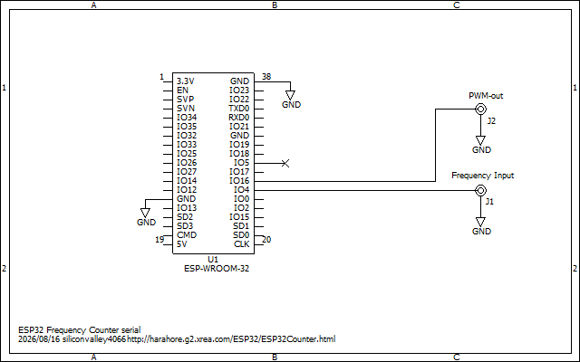
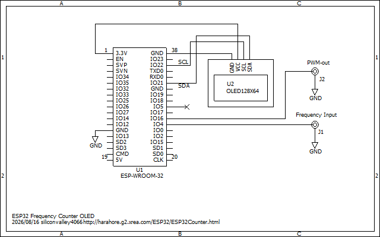

# FreqCountESPgate
Stable and accurate Frequency Counter Library for ESP32

This counts the input pulse by PCNT with the gate signal generated by LEDC.
The gate timing is completely managed by the hardware.
So, it is fairly stable and accurate.

There is already a frequency count library https://github.com/kapraran/FreqCountESP
 
The time frame is accomplished by the software timer and the interrupts. So, the time frame fluctuates by ±0.3 microseconds.
It is sufficient for below 1MHz, however, at around 30 MHz, a fluctuation of ±9 Hz occurs.
An error of ±32,767 counts may occur during the process of integrating the PCNT hardware count with the software-based overflow count.
So, I have developed this new library.

## Specifications:
- Nominal gate time is 1 second and 0.1 second.
- Actual gate time is 937.5ms and 93.75ms.
- Frequency range is 1Hz to 40MHz. Practical upper limit is 32MHz.
- Input voltage range 0 to 3.3V

## Develop environment is: 
- Arduino IDE 2.3.10 
- esp32 by Espressif Systems version 3.3.11 

Select the board: "DOIT ESP32 DEVKIT V1" or "NodeMCU-32S" 

## Sample program "serial" outputs to Arduino IDE Serial Monitor.
Schematics for Serial output: 

## Sample program "oled" displays on 128x64 OLED.
Libraries: Tiny4kOLED 
Schematics for OLED display: 

Description is here, although it is written in Japanese language: 
https://ss1.xrea.com/harahore.g2.xrea.com/ESP32/ESP32Counter.html

# References:
kapraran https://github.com/kapraran/FreqCountESP 
siliconvalley4066 https://github.com/siliconvalley4066/FreqCountESP 
Tj Lab https://tj-lab.org/2022/12/08/esp32-s3-%e3%82%92%e4%bd%bf%e3%81%a3%e3%81%9f%e5%91%a8%e6%b3%a2%e6%95%b0%e3%82%ab%e3%82%a6%e3%83%b3%e3%82%bf/comment-page-1/ 
